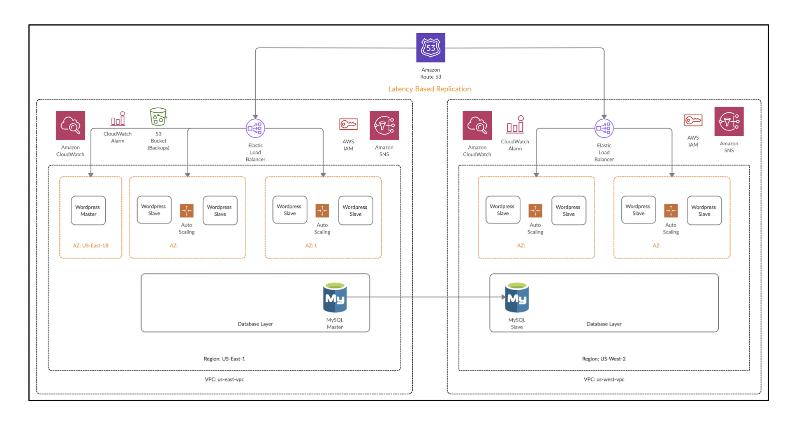

# Highly Available, Multi-Region WordPress Platform on AWS

A production-pattern WordPress deployment spanning two AWS regions, built to handle
millions of page views with no single point of failure, automated content propagation,
and latency-based global routing.

**Live concept:** `your-domain.com` served from **US-East-1** (primary) and
**US-West-2** (secondary), with Route 53 routing each visitor to whichever region
gives them the lowest latency.

---

## Architecture



| Layer | US-East-1 (Primary) | US-West-2 (Secondary) |
|---|---|---|
| **Compute** | WordPress Master (manual) + AutoScaled Slave(s) | AutoScaled Slave(s) only |
| **Database** | RDS MySQL Primary | RDS MySQL Read Replica |
| **Load Balancing** | Classic ELB | Classic ELB |
| **Network** | Custom VPC — 2 public subnets / 2 private subnets across 2 AZs | Same pattern |
| **CDN** | Amazon CloudFront (origin: East ELB) | — |
| **DNS** | Route 53 — latency-based routing, root + `www` | |
| **Storage / Backup** | S3 (continuous sync) + Lifecycle → Glacier (7 days) | |

**Why this shape:** all writes happen on one designated Master instance so editors
always know exactly which server they're hitting. Everything else — Slaves in both
regions — is disposable and interchangeable, scaled automatically by CPU load, and
rebuilt from a pre-baked AMI rather than bootstrapped from scratch on every launch.

---

## AWS Services Used

`EC2` · `RDS (MySQL, cross-region Read Replica)` · `VPC` (public/private subnets,
2 AZs per region) · `Elastic Load Balancing` · `Auto Scaling Groups` · `S3`
(sync + lifecycle policies) · `CloudFront` · `Route 53` (latency-based routing) ·
`IAM` (least-privilege instance roles) · `SNS` (scaling event notifications) ·
`CloudWatch` (alarms driving the scaling policy)

---

## Key Implementation Details

### 1. Region-aware database connection

Instead of hardcoding a single database host, `wp-config.php` queries EC2 instance
metadata at runtime to detect which region it's running in, then connects to the
**local** database — the primary in `us-east-1`, the read replica in `us-west-2`:

```php
$REGION = shell_exec("curl -s http://169.254.169.254/latest/meta-data/placement/availability-zone | sed s'/.$//'");

if ($REGION == 'us-east-1') {
    define('DB_HOST', '<east-rds-endpoint>.us-east-1.rds.amazonaws.com');
} elseif ($REGION == 'us-west-2') {
    define('DB_HOST', '<west-replica-endpoint>.us-west-2.rds.amazonaws.com');
}
```

This means the **same AMI** can be deployed in either region without modification.

### 2. Content propagation via S3 (Master → Slaves, <15 min worst case)

The Master server pushes to S3 every 5 minutes:

```bash
echo "*/5 * * * * /usr/bin/aws s3 sync --delete /var/www/html s3://<bucket-name>" | sudo crontab -
```

Every AutoScaled instance pulls from S3 every 5 minutes, embedded directly in the
Launch Template's user data so it's active from first boot:

```bash
#!/bin/bash
echo "*/5 * * * * /usr/bin/aws s3 sync s3://<bucket-name> /var/www/html" | sudo crontab -
```

Combined with a custom "golden AMI" (apps pre-installed, content pulled fresh from
S3 on boot), new instances are production-ready within minutes of being launched
by Auto Scaling — no manual provisioning required.

### 3. Network isolation

- Web tier (EC2, ELB) lives in **public subnets**.
- Database tier (RDS primary + replica) lives in **private subnets** with no
  public route — reachable only from the web tier's security group on port 3306.
- A dedicated IAM role (`ec2_to_s3`) is attached to every instance so they can read/write
  S3 without embedding access keys anywhere.

### 4. Failure handling

- AutoScaling Groups in both regions replace unhealthy instances automatically
  (CPU > 50% scale-out / scale-in policy).
- Load balancer health checks hit a lightweight `/ping.html` endpoint.
- SNS notifies on every launch/terminate/failure event.

---

## Challenges & Debugging Notes

A few of the more interesting issues hit (and fixed) along the way — the kind of
thing that doesn't show up in a clean architecture diagram:

- **Silent health-check failures from a missing outbound rule.** A security group
  had inbound rules wide open but *zero* outbound rules — requests reached the
  instance fine, but the health-check response had no path back to the ELB. Classic
  "it looks healthy from inside, but the load balancer disagrees" bug.

- **ELB/ASG subnet mismatch.** The load balancer was registered to one pair of
  subnets while the Auto Scaling Group launched instances into a *different* pair
  in the same AZs — same Availability Zone, wrong actual network. No amount of
  security-group tweaking fixes a problem that's really about which subnet
  resources land in.

- **CNAME vs. Alias at the zone apex.** Route 53 won't allow a CNAME record at a
  bare domain (`example.com`) — only on subdomains. The fix is an **A record with
  Alias enabled**, which is the AWS-specific mechanism that lets a root domain
  point at a load balancer's DNS name without violating standard DNS rules.

- **Region/instance-type capacity limits.** Reference architectures often default
  to instance families (or default subnets/AZs) that hit account-level capacity or
  quota limits in practice — worth always having a fallback instance type or AZ in
  mind rather than assuming the first choice will provision cleanly.

- **A reference architecture isn't always complete.** The provided design diagram
  didn't include a CDN layer, despite the written requirements explicitly calling
  for one — a good reminder to cross-check requirements docs against architecture
  diagrams rather than assuming they're in sync.

---

## What This Project Demonstrates

- Designing for **no single point of failure** across compute, database, and network layers
- **Cross-region database replication** with application-level, runtime region detection
- **Immutable infrastructure** patterns (golden AMI + externalized content/config via S3)
- **Least-privilege IAM** and public/private network segmentation
- Reading past a clean reference diagram to **identify and close gaps** against the
  actual written requirements
- Debugging real, non-obvious infrastructure failures (security group direction,
  subnet/AZ mismatches, DNS record-type constraints)

---

## Cost

Estimated using the [AWS Pricing Calculator](https://calculator.aws): **~$100/month**
for the full two-region footprint (EC2, RDS primary + replica, dual ELBs, S3,
CloudFront) at constant low-traffic usage — illustrating the cost/availability
tradeoffs architects make when sizing a real deployment.

---

Built as part of a cloud computing course project. Live infrastructure has since
been decommissioned to avoid ongoing AWS charges; this repository documents the
design, configuration, and lessons learned.
